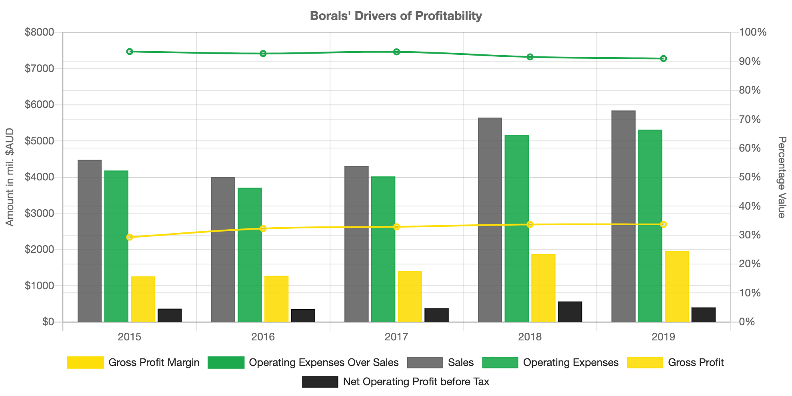
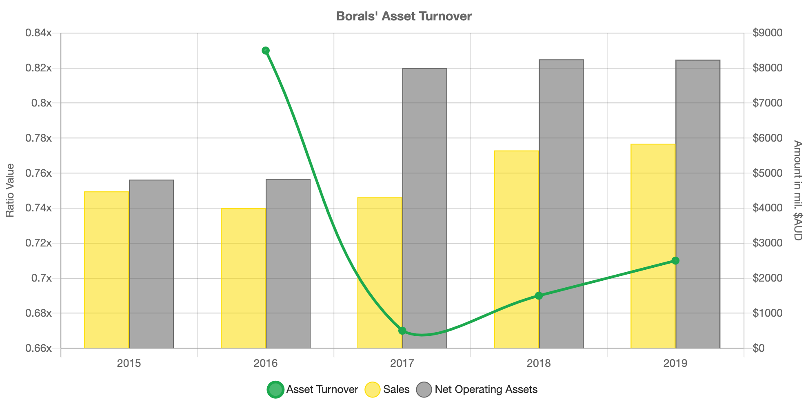
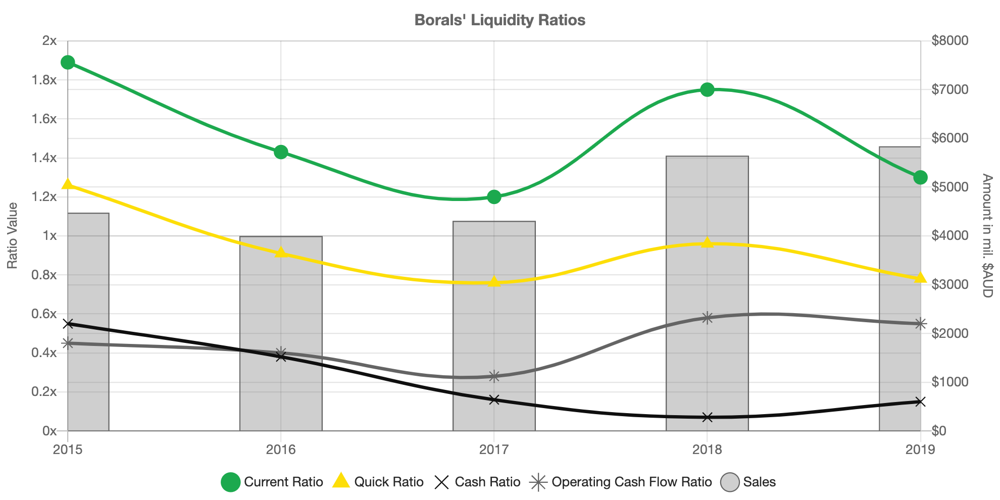

# Chart JS Testing
Created some charts for my girlfriends university accounting assignment. Might be useful practical examples for how to use the amazing [`chart.js`](https://www.chartjs.org/) library.

## Sample Images

